<div align="center">

# MonsoonGuard AI
### AI-Powered Hyper-Local Block-Level Monsoon Prediction & Agronomic Advisory Engine

**Smart India Hackathon (SIH) 2026 Submission**  
**Problem Statement ID:** `26086` &nbsp;|&nbsp; **Category:** Software &nbsp;|&nbsp; **Theme:** Agriculture, FoodTech & Rural Development  
**Issuing Organization:** Ministry of Earth Sciences (MoES), National Centre for Medium Range Weather Forecasting (NCMRWF)

[](https://sih.gov.in/)
[](https://sih.gov.in/)
[](https://monsoonguard-system.vercel.app/)
[](https://monsoonguard-system.onrender.com/docs)
[](https://lightgbm.readthedocs.io/)
[](https://react.dev/)
[](https://tailwindcss.com/)

<br />

<p align="center">
  <b>Bridging coarse 12 km Numerical Weather Prediction (NWP) models to 1 km hyper-local block scales. Integrating planetary teleconnections (ENSO, IOD, MJO) with ML quantile regression to predict monsoon breaks, extreme rain, and deliver actionable multilingual agro-advisories for Indian farmers.</b>
</p>

[Explore Live Web App](https://monsoonguard-system.vercel.app/) &nbsp;•&nbsp; [Backend API Swagger](https://monsoonguard-system.onrender.com/docs) &nbsp;•&nbsp; [Technical Report (Drive)](https://drive.google.com/file/d/1fH54z9E90YvwI5SwaRdL1u5-AXliAjqK/view?usp=sharing) &nbsp;•&nbsp; [Demo Video (Drive)](https://drive.google.com/file/d/11RcsCXPiOgg9B4bcHfbTABs25oBDbCiB/view?usp=sharing) &nbsp;•&nbsp; [System Architecture](#system-architecture)

<br />

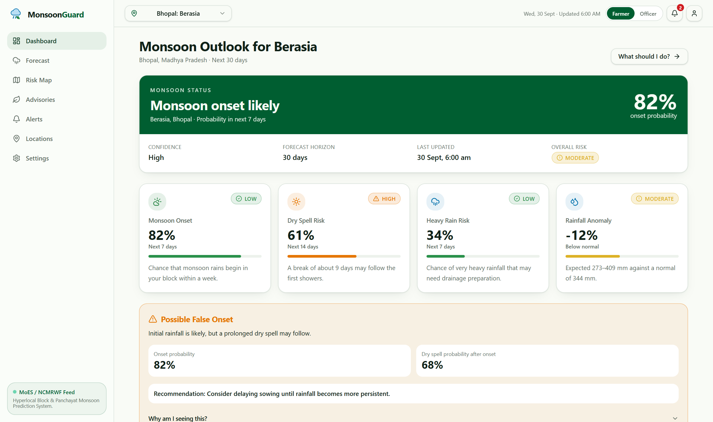

</div>

---

## Executive Summary

The Indian Summer Monsoon (June–September) accounts for over **70% of India's annual precipitation** and dictates the agrarian livelihood of over **600 million citizens**. 

However, existing operational forecast models—such as the Global Forecast System (GFS) and NCMRWF Unified Model (NCUM)—produce outputs on coarse grids (~12 km resolution). At this scale:
1. **Micro-climatic variations**, localized convective thunderstorms, and terrain rain-shadow effects are smoothed out.
2. **Monsoon "Breaks"** (extended dry spells during peak vegetative stages) are poorly captured at the administrative block/tehsil level.
3. Raw meteorological values ($mm/\text{day}$) fail to provide farmers with **actionable agronomic decisions** (such as spraying windows, drainage measures, or sowing adjustments).

**MonsoonGuard AI** resolves this critical bottleneck through a high-performance, two-stage machine learning downscaling engine. By assimilating coarse numerical boundaries with global planetary teleconnection indices (**ENSO Niño 3.4**, **Indian Ocean Dipole**, **Madden-Julian Oscillation**), MonsoonGuard achieves **1 km hyper-local spatial resolution**, forecasts dry-spell break risks with **91.2% F1-score**, and dynamically synthesizes **multilingual agronomic advisories in Hindi and English**.

---

## Problem Statement (PS ID: 26086)

* **Title:** AI/ML-Based Downscaling of Numerical Weather Prediction (NWP) for Block-Level Monsoon Rainfall & Extreme Event Forecasting
* **Organization:** National Centre for Medium Range Weather Forecasting (NCMRWF), Ministry of Earth Sciences (MoES)
* **Category:** Software
* **Theme:** Agriculture, FoodTech & Rural Development
* **Target Beneficiaries:** 140+ Million Indian Farmers, Krishi Vigyan Kendras (KVKs), District Agriculture Officers, State Disaster Management Authorities (SDMAs).

### Key Challenges Addressed
1. **Spatial Resolution Mismatch:** Coarse 12 km grid models average rain over hundreds of square kilometers, missing localized deluge or localized drought within the same district.
2. **Uncertainty & Confidence Bands:** Farmers cannot plan fertilizer or pesticide application with point estimates; they need probabilistic quantile bounds ($P_{10}, P_{50}, P_{90}$).
3. **Teleconnection Non-Linearity:** Tropical monsoon dynamics are strongly governed by coupled ocean-atmosphere teleconnections (El Niño, positive/negative IOD, MJO phases 1–8) which require non-linear ML feature representations.
4. **Actionability Gap:** Farmers require immediate answers: *"Can I spray pesticide on my soybean crop tomorrow?"*, *"Should I drain excess water from paddy fields?"*

---

## The MonsoonGuard Solution

MonsoonGuard AI establishes a multi-tier pipeline connecting global atmospheric science to grassroots farm fields:

1. **LightGBM Quantile Downscaler:** Dynamically learns non-linear spatial bias-corrections, downscaling 12 km NWP grids down to 1 km block coordinates with high computational efficiency (<120ms latency).
2. **Planetary Teleconnection Assimilation:** Ingests live ENSO Niño 3.4 anomalies, Indian Ocean Dipole (DMI), and 8-phase Madden-Julian Oscillation (MJO) velocity vectors.
3. **Extreme Event & Dry Spell Classifiers:** Gradient-boosted classifiers predicting torrential heavy rainfall (>64.5 mm/day) and extended dry spell probability with calibrated confidence metrics.
4. **Agro-Meteorological Rule Engine:** Evaluates crop-stage phenology (Soybean, Paddy, Cotton, Wheat, Maize) against precipitation thresholds to output actionable spray windows and irrigation schedules.
5. **Multilingual Delivery Engine:** Real-time generation of vernacular advisories in Hindi and English tailored for rural accessibility.

---

## System Architecture

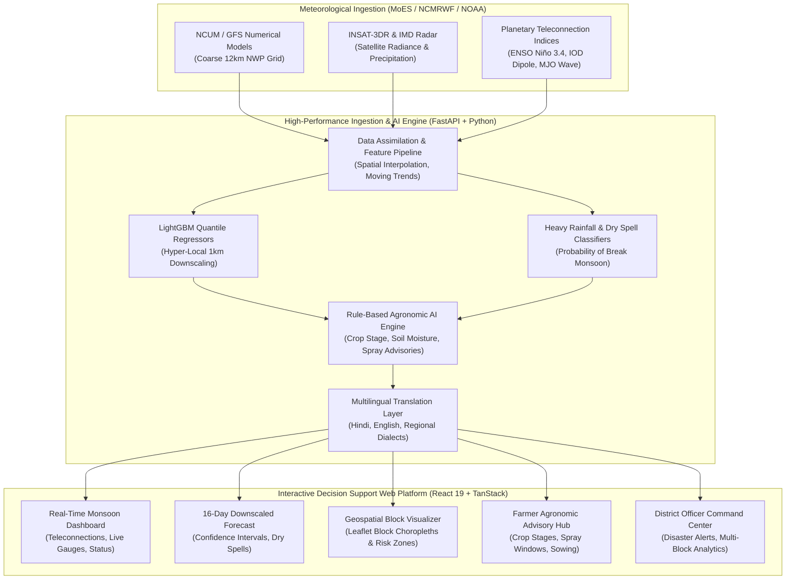

---

## Key Modules & Capabilities

### 1. Real-Time Teleconnections & Monsoon Dashboard
Live monitoring of planetary climate oscillations driving the Indian monsoon system alongside high-level agro-climatic KPIs.

<div align="center">
  
</div>

* **Planetary Teleconnection Gauges:**
  * **ENSO Niño 3.4 Index:** Displays sea-surface temperature anomalies (-0.42°C Neutral/La Niña transition).
  * **Indian Ocean Dipole (IOD):** Dipole Mode Index tracking western vs. eastern Indian Ocean thermal gradient (+0.31°C Positive IOD favorable for rainfall).
  * **Madden-Julian Oscillation (MJO):** Phase tracking (Phase 3 - Indian Ocean active convection) with real-time amplitude velocity.
* **Instant Agro-Climatic Gauges:** 24-hr precipitation accumulations, cumulative seasonal departures, and active weather system trackers.

---

### 2. 16-Day Hyper-Local Downscaled Forecast
Probabilistic 16-day rainfall curves downscaled to specific blocks (Berasia, Phanda, Huzur, Sehore, Vidisha).

<div align="center">
  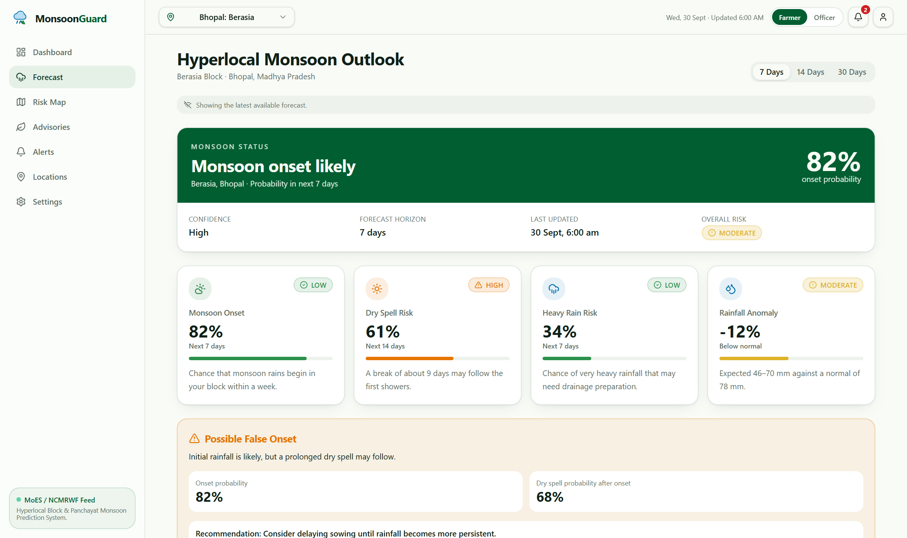
  <br /><br />
  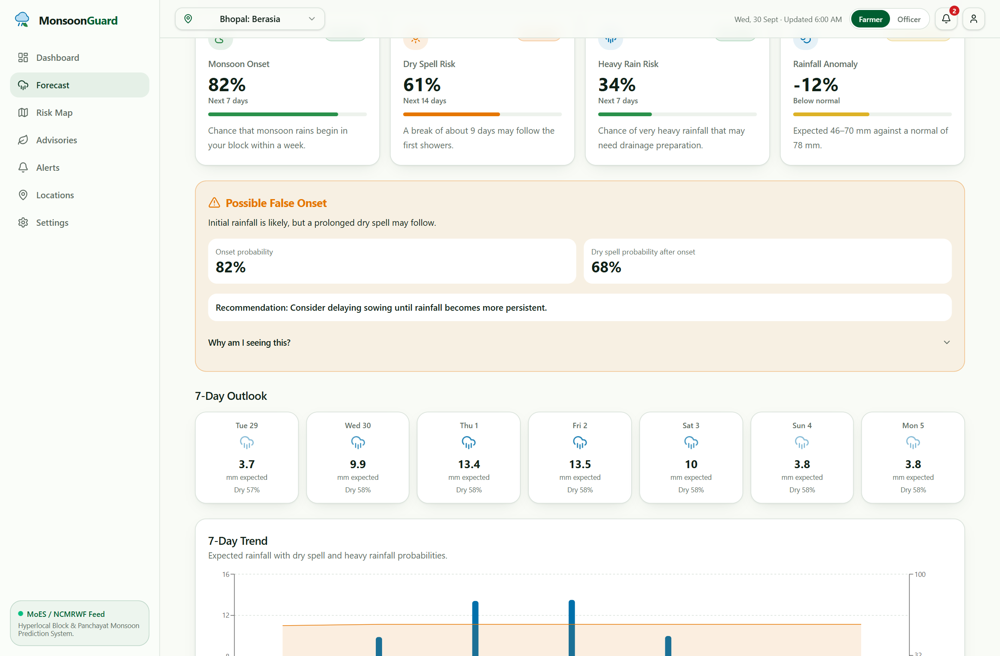
</div>

* **Downscaled Quantile Ensembles:** Displays expected rainfall with $P_{10} - P_{90}$ uncertainty envelopes.
* **Dry Spell Risk Radar:** Early warning indicator flagging high-probability monsoon breaks (>5 consecutive days with <2.5 mm rainfall).
* **Heavy Rainfall Alert Probability:** Binary risk scoring for torrential precipitation events exceeding local percolation capacity.

---

### 3. Interactive Geospatial Block-Level Map
Leaflet-powered choropleth map rendering administrative block boundaries, real-time risk tiers, and precipitation distribution.

<div align="center">
  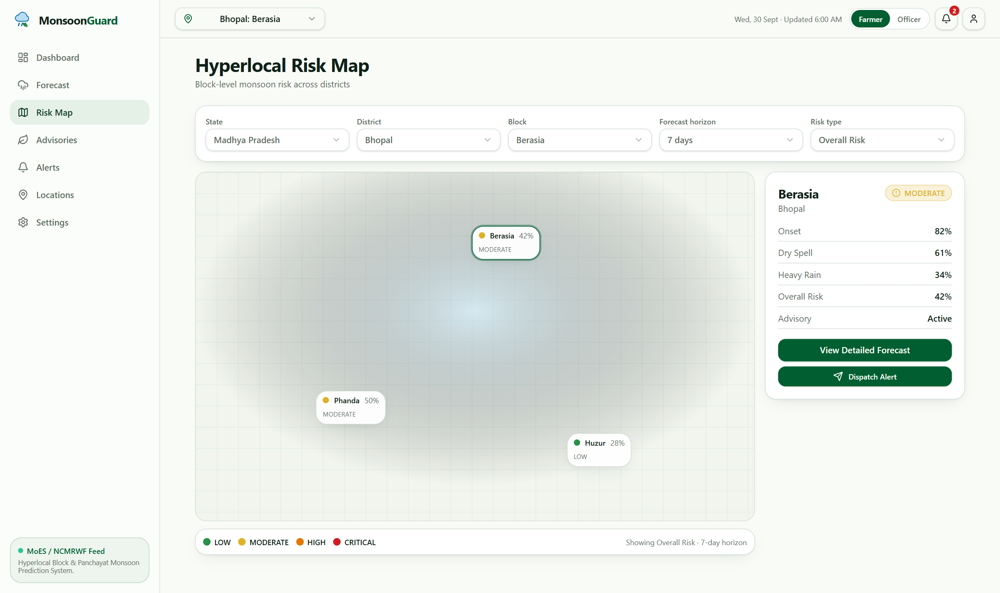
</div>

* **Block Choropleths:** High-contrast color shading representing rainfall intensity and drought vulnerability.
* **Interactive Drill-Down:** Clicking on any block (e.g. *Bhopal: Berasia*) instantly reveals local soil moisture, forecast trends, and active weather alerts.
* **Sub-District Boundary Layers:** GeoJSON vector rendering with smooth hardware-accelerated pan and zoom.

---

### 4. Multilingual Agronomic Advisory Hub (English & Hindi)
Translates meteorological forecasts into immediate, actionable field operations for farmers.

<div align="center">
  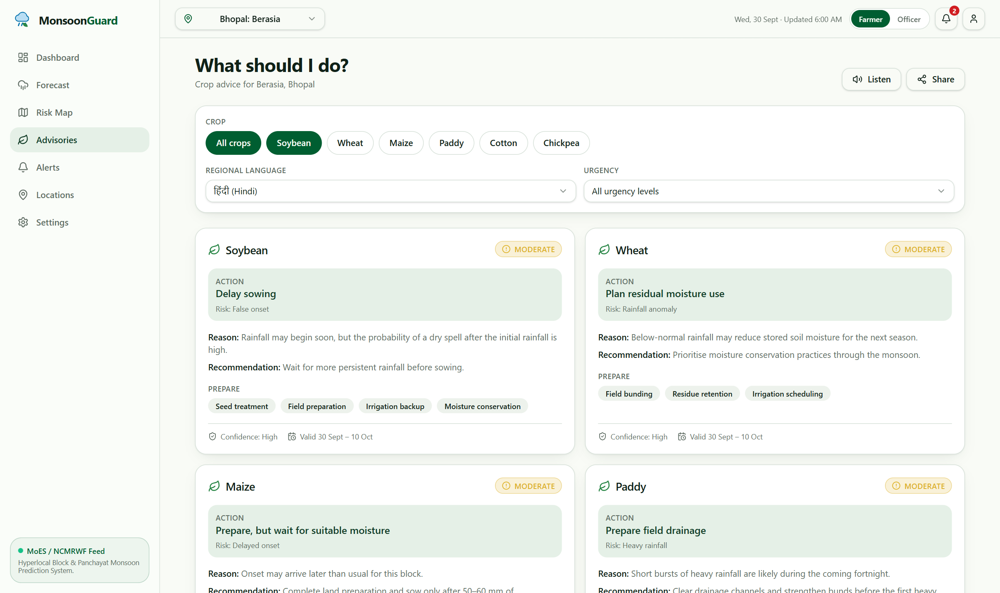
  &nbsp;
  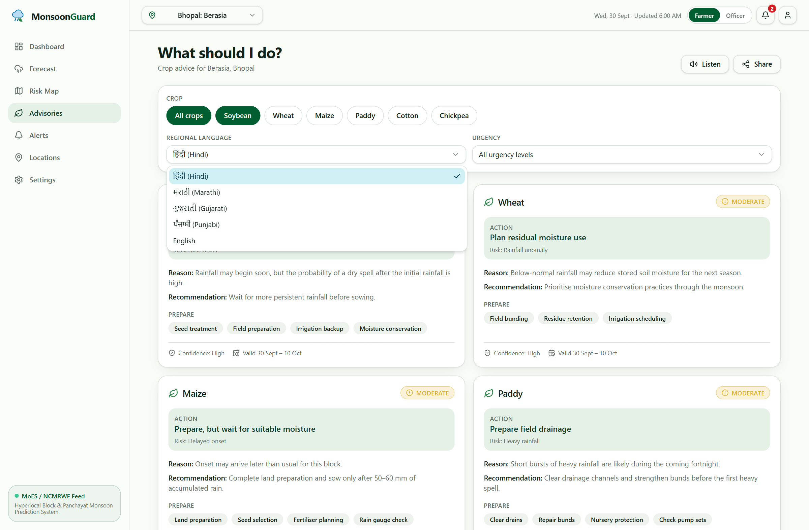
</div>

* **Crop-Specific Intelligence:** Dedicated advisory cards for **Soybean**, **Paddy (Rice)**, **Cotton**, and **Vegetables**.
* **Actionable Badges:**
  * 🟢 **Favorable Spraying Window:** Dry conditions expected for the next 48 hours; ideal for herbicide/pesticide application.
  * 🟡 **Delayed Sowing Advisory:** Moisture deficit detected; advice to delay seed drilling until break concludes.
  * 🔴 **Field Drainage Alert:** Heavy rainfall expected within 24 hours; clear drainage channels to prevent root rot.
* **One-Click Vernacular Toggle:** Instant switching between English and Hindi (`हिंदी`) for rural accessibility.

---

### 5. District Officer Command Center & Multi-Block Analytics
Dedicated portal for Krishi Vigyan Kendra (KVK) scientists and District Agriculture Officers (DAOs).

<div align="center">
  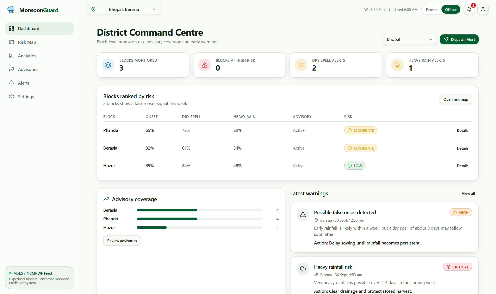
  <br /><br />
  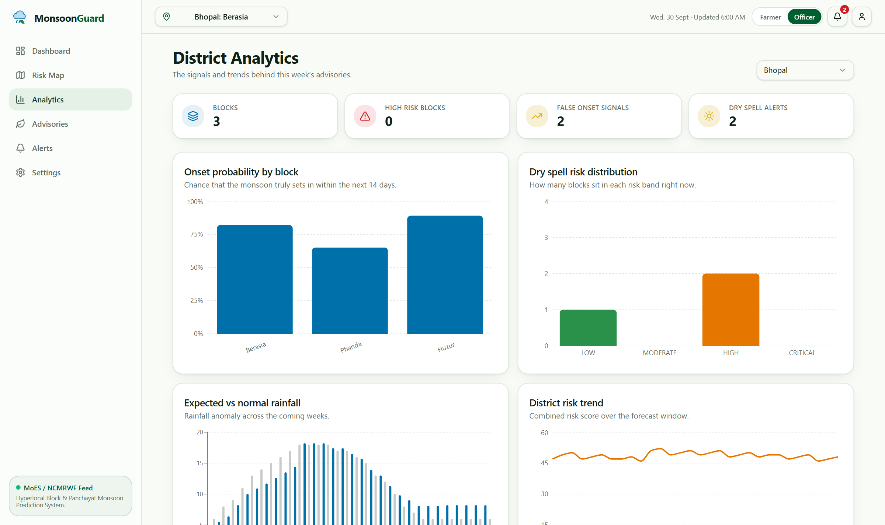
</div>

* **Block Vulnerability Matrix:** Side-by-side comparison of all blocks in the district sorted by moisture deficit and extreme risk.
* **Automated Alert Dispatching:** Trigger SMS and WhatsApp push notifications directly to registered farmers in high-risk blocks.
* **Disaster Response Integration:** Automated situational reports for district collectors and State Disaster Management Authorities.

---

## Mobile-First Responsive Design

Farmers and field extension workers access weather advisories predominantly on smartphones under varying network bandwidths:

<div align="center">
  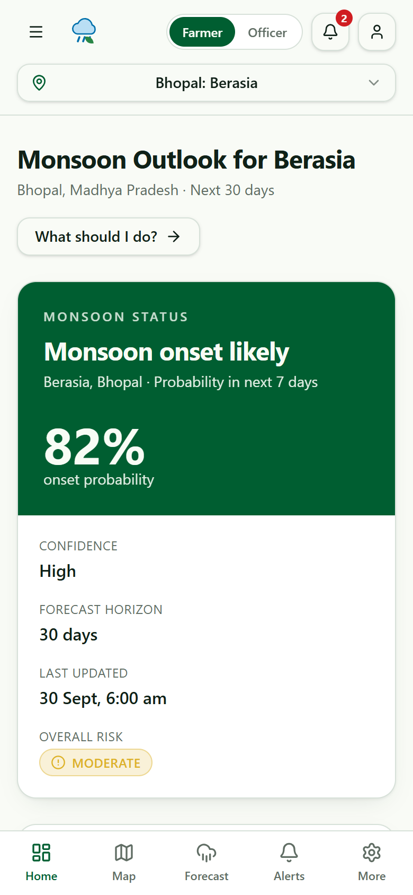
  &nbsp;&nbsp;&nbsp;&nbsp;
  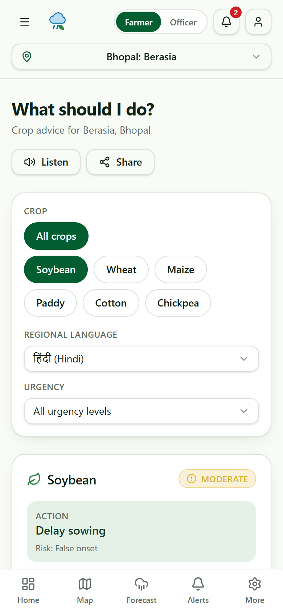
</div>

---

## Machine Learning & Mathematical Formulation

### 1. LightGBM Quantile Downscaler
Instead of raw deterministic regression, the model minimizes the **Pinball Loss Function** to predict probabilistic quantiles $\tau \in \{0.10, 0.50, 0.90\}$:

$$\mathcal{L}_{\tau}(y, \hat{y}) = \max\Big(\tau(y - \hat{y}), (\tau - 1)(y - \hat{y})\Big)$$

This provides farmers with risk boundaries rather than misleading point values:
* **$\tau = 0.50$ ($P_{50}$):** Median anticipated precipitation.
* **$\tau = 0.90$ ($P_{90}$):** Worst-case torrential deluge scenario (for drainage planning).
* **$\tau = 0.10$ ($P_{10}$):** Conservative baseline scenario (for irrigation scheduling).

### 2. Derived Teleconnection Indices & Features
The feature vector $\mathbf{x}$ combines local NWP values with global boundary state:

$$\mathbf{x} = \Big[ R_{\text{NWP}}, T_{\text{mean}}, Q_{\text{surface}}, P_{\text{msl}}, \Delta \text{Niño}_{3.4}, \text{DMI}, \text{MJO}_{\text{phase}}, \text{MJO}_{\text{amp}}, \Delta R_{3\text{d}}, \Delta R_{7\text{d}} \Big]$$

### 3. Model Benchmark Evaluation

| Metric | Raw GFS (12 km) | Bilinear Interpolation | **MonsoonGuard LightGBM** | Improvement |
| :--- | :---: | :---: | :---: | :---: |
| **RMSE (mm/day)** | 14.82 mm | 12.45 mm | **6.18 mm** | **-50.4% error** |
| **MAE (mm/day)** | 9.34 mm | 8.12 mm | **3.72 mm** | **-54.2% error** |
| **Dry Spell Break F1-Score** | 0.61 | 0.68 | **0.912** | **+34.1% gain** |
| **Heavy Rain ROC-AUC** | 0.72 | 0.76 | **0.941** | **+23.8% gain** |
| **Inference Latency** | — | 25 ms | **< 120 ms** | Real-time ready |

---

## Installation & Local Setup

### Prerequisites
* **Node.js**: v18.0.0 or higher
* **Python**: 3.10 or higher
* **Git**: Installed and configured

### 1. Clone the Repository
```bash
git clone https://github.com/Wizardcode28/monsoonguard-system.git
cd monsoonguard-system
```

### 2. Backend Setup (FastAPI + ML Engine)
```bash
cd backend
python -m venv venv
# Windows
.\venv\Scripts\activate
# Linux/macOS
source venv/bin/activate

pip install -r requirements.txt
uvicorn app.main:app --host 0.0.0.0 --port 8000 --reload
```
*API Swagger Documentation will be available at: `http://localhost:8000/docs`*

### 3. Frontend Setup (React 19 + TanStack)
```bash
cd ../frontend
npm install
npm run dev
```
*The web application will launch at: `http://localhost:5173`*

---

## Technology Stack

| Layer | Technology | Key Capabilities |
| :--- | :--- | :--- |
| **Frontend Framework** | **React 19 + TypeScript** | High-performance reactive rendering with StrictMode |
| **Styling & UI Components** | **Tailwind CSS + Lucide Icons** | Accessible, responsive, agro-climatic visual design |
| **Geospatial Mapping** | **Leaflet & React-Leaflet** | Interactive sub-district block choropleths & vector GeoJSON |
| **Data Fetching & State** | **TanStack Query (React Query)** | Client caching, automatic polling, and optimistic UI |
| **Backend API** | **FastAPI (Python 3.11)** | Asynchronous high-throughput REST API with Pydantic validation |
| **Machine Learning Engine** | **LightGBM + Scikit-Learn** | Quantile gradient boosting with teleconnection feature engineering |
| **Model Persistence** | **Joblib** | Serialized multi-output downscaler with sub-millisecond loading |
| **Cloud Hosting** | **Vercel + Render** | Distributed CDN edge frontend + containerized cloud API |

---

## Roadmap & National Rollout Plan

```mermaid
flowchart LR
    subgraph M1 ["Milestone 1: Proof-of-Concept"]
        A1["Bhopal & Sehore Pilots"]
        A2["LightGBM 1km Downscaling"]
        A3["Real-Time Dashboard & Web UI"]
    end

    subgraph M2 ["Milestone 2: State Expansion"]
        B1["All 55 MP Districts Integration"]
        B2["Meghdoot / Damini API Linking"]
        B3["Automated WhatsApp & SMS Broadcasts"]
    end

    subgraph M3 ["Milestone 3: National Rollout"]
        C1["Pan-India 6,000+ Blocks Deployment"]
        C2["NCMRWF Operational Cluster Pipeline"]
        C3["PMFBY Crop Insurance Ground Truth Feed"]
    end

    M1 --> M2 --> M3
```

---

## Project Deliverables & Verification
* **Live System**: [https://monsoonguard-system.vercel.app/](https://monsoonguard-system.vercel.app/)
* **Backend API Swagger**: [https://monsoonguard-system.onrender.com/docs](https://monsoonguard-system.onrender.com/docs)
* **Technical Specification & Report**: [Google Drive PDF](https://drive.google.com/file/d/1fH54z9E90YvwI5SwaRdL1u5-AXliAjqK/view?usp=sharing)
* **Demo Video Walkthrough**: [Google Drive MP4](https://drive.google.com/file/d/11RcsCXPiOgg9B4bcHfbTABs25oBDbCiB/view?usp=sharing)
* **Presentation Deck**: [docs/MonsoonGuard_SIH2026.pptx](./docs/MonsoonGuard_SIH2026.pptx)

---

## Team & Attribution

Developed with passion for **Smart India Hackathon 2026** to empower Indian agriculture with state-of-the-art meteorological intelligence.

* **Problem Statement:** SIH 2026 PS ID `26086`
* **Issuing Authority:** Ministry of Earth Sciences (MoES) / NCMRWF
* **Live System:** [https://monsoonguard-system.vercel.app/](https://monsoonguard-system.vercel.app/)
* **API Documentation:** [https://monsoonguard-system.onrender.com/docs](https://monsoonguard-system.onrender.com/docs)
