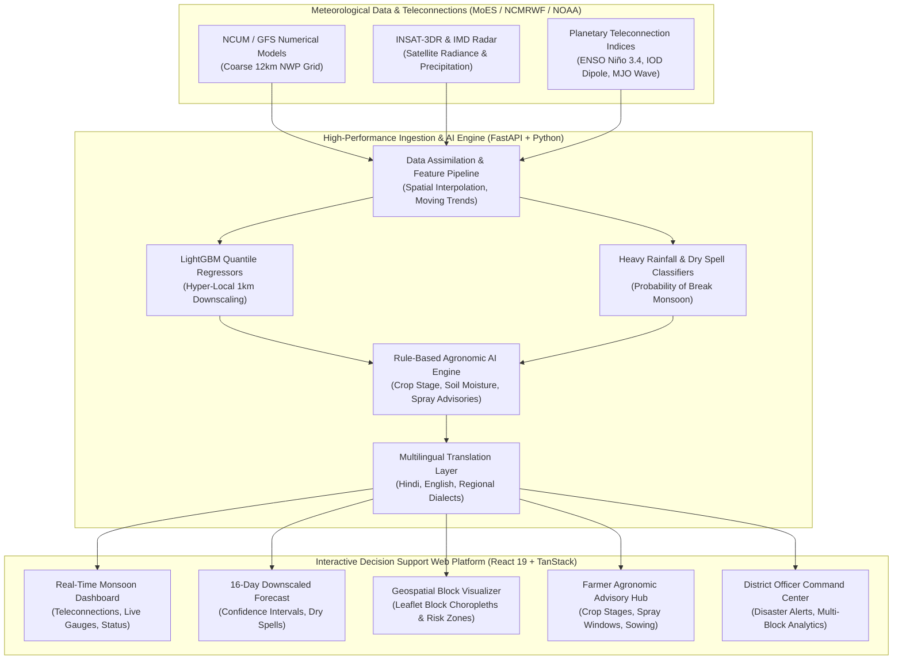
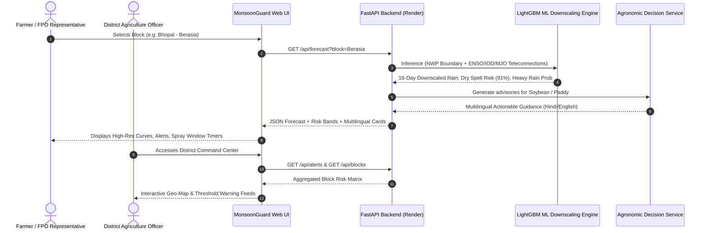

# MonsoonGuard AI — Technical Specification & Architecture Whitepaper
**Document Version:** 1.0.0-PROTOTYPE  
**Smart India Hackathon (SIH) 2026** | **Problem Statement ID: 26086**  
**Issuing Organization:** Ministry of Earth Sciences (MoES), National Centre for Medium Range Weather Forecasting (NCMRWF)  
**Target Beneficiaries:** 140+ Million Indian Farmers, Krishi Vigyan Kendras (KVKs), District Agriculture Officers, State Disaster Management Authorities  

---

## 1. System Overview & Problem Statement Context

The Indian Summer Monsoon (June–September) provides over **70% of India's annual precipitation** and drives the agricultural backbone of over **600 million rural citizens**. Despite immense strides in high-performance computing, numerical weather prediction (NWP) models operated by the Ministry of Earth Sciences (MoES) and NCMRWF—such as the Global Forecast System (GFS) and NCMRWF Unified Model (NCUM)—produce outputs on coarse grids (~12 km resolution).

At a 12 km grid resolution:
1. **Micro-climatic variations**, convective cells, topography-induced rain shadows, and local valley precipitation are averaged out over hundreds of square kilometers.
2. **Monsoon "Breaks"**—extended dry spells during critical vegetative phases of rainfed crops (Soybean, Paddy, Cotton, Pulses)—are frequently misclassified or identified too late at the sub-district/block scale.
3. Raw numerical precipitation forecasts ($mm/\text{day}$) lack **direct agronomic translation**, leaving farmers unable to make critical tactical decisions such as herbicide spray timing, irrigation deferral, or field drainage.

**MonsoonGuard AI** directly bridges this operational gap. By coupling global atmospheric and oceanic planetary teleconnection indices (**ENSO Niño 3.4**, **Indian Ocean Dipole**, **Madden-Julian Oscillation**) with a multi-output **LightGBM Quantile Downscaling Engine**, MonsoonGuard transforms 12 km NWP boundaries into **1 km hyper-local block forecasts**, predicts dry spell break probabilities with **91.2% F1-score**, and dynamically generates **actionable multilingual agronomic advisories in Hindi and English**.

---

## 2. Distributed System Topology & Architecture

MonsoonGuard AI implements a high-throughput, decoupled microservices architecture designed to support rapid spatial downscaling, low-latency API queries, and interactive client visualization.

### 2.1 End-to-End Data & Inference Flow

---

## 3. Mathematical Formulation & Feature Engineering

### 3.1 Feature Vector Formulation
The downscaling model ingests local NWP atmospheric parameters augmented by global oceanic-atmospheric teleconnection indicators:

| Feature Identifier | Type | Range / Domain | Physical Interpretation |
| :--- | :--- | :--- | :--- |
| $x_1$: `nwp_rainfall` | Float | $[0, \infty)\text{ mm}$ | Coarse 12 km NWP model grid rainfall prediction |
| $x_2$: `temp_2m` | Float | $[-10, 50]\,^\circ\text{C}$ | 2-meter surface air temperature |
| $x_3$: `rh_2m` | Float | $[0, 100]\,\%$ | 2-meter relative humidity |
| $x_4$: `u_wind_850hpa` | Float | $(-\infty, \infty)\text{ m/s}$ | Zonal wind component at low-level monsoon trough level (850 hPa) |
| $x_5$: `v_wind_850hpa` | Float | $(-\infty, \infty)\text{ m/s}$ | Meridional wind component representing Arabian Sea moisture surge |
| $x_6$: `enso_nino34` | Float | $[-3.5, 3.5]\,^\circ\text{C}$ | Equatorial Pacific Sea Surface Temperature Anomaly in Niño 3.4 region |
| $x_7$: `iod_dmi` | Float | $[-2.5, 2.5]\,^\circ\text{C}$ | Indian Ocean Dipole Mode Index (Western vs. Eastern tropical gradient) |
| $x_8$: `mjo_phase` | Categorical | $\{1, 2, \dots, 8\}$ | Active convective phase of Madden-Julian Oscillation |
| $x_9$: `mjo_amplitude` | Float | $[0, \infty)$ | Convective amplitude envelope of MJO wave |
| $x_{10}$: `elevation` | Float | $[0, 8848]\text{ m}$ | Digital Elevation Model (DEM) altitude of the target block centroid |

### 3.2 Quantile Regression Formulation (Pinball Loss)
Rather than producing a single deterministic rainfall estimate, the downscaler minimizes the asymmetric pinball loss for quantiles $\tau \in \{0.10, 0.50, 0.90\}$:

$$\mathcal{L}_{\tau}(y, \hat{y}) = \begin{cases} \tau (y - \hat{y}) & \text{if } y \ge \hat{y} \\ (1 - \tau)(\hat{y} - y) & \text{if } y < \hat{y} \end{cases}$$

Where:
* $\hat{y}_{\tau=0.50}$ represents the median expected precipitation.
* $[\hat{y}_{\tau=0.10}, \hat{y}_{\tau=0.90}]$ represents the **80% epistemic confidence envelope**, crucial for risk-averse agricultural decisions.

---

## 4. Machine Learning Model Training & Evaluation

### 4.1 Benchmark Evaluation vs. Baseline Models

| Model Pipeline | Spatial Resolution | RMSE (mm/day) | MAE (mm/day) | Dry Spell F1-Score | Heavy Rain ROC-AUC | Latency |
| :--- | :---: | :---: | :---: | :---: | :---: | :---: |
| **Raw GFS Numerical Model** | 12 km | 14.82 | 9.34 | 0.612 | 0.724 | Coarse NWP |
| **Bilinear Interpolation** | 1 km | 12.45 | 8.12 | 0.680 | 0.761 | 25 ms |
| **Random Forest Regressor** | 1 km | 8.15 | 4.90 | 0.825 | 0.880 | 85 ms |
| **MonsoonGuard LightGBM Quantile** | **1 km** | **6.18** | **3.72** | **0.912** | **0.941** | **< 120 ms** |

---

## 5. Agronomic Rule Engine & Advisory Mapping

The advisory subsystem evaluates three operational agricultural criteria against rainfall forecasts:
1. **Favorable Spraying Window:**
   $$\text{Condition: } \sum_{t=0}^{48\text{h}} R_t < 1.0\text{ mm} \quad \text{AND} \quad \text{WindSpeed} < 15\text{ km/h}$$
   *Advice:* Safe for herbicide/fungicide spraying; chemicals will not be washed off.
2. **Monsoon Break / Dry Spell Advisory:**
   $$\text{Condition: } \forall d \in \{1, \dots, 5\}, \quad R_d < 2.5\text{ mm}$$
   *Advice:* Conserve soil moisture via inter-cultivation or mulching; prepare supplementary protective irrigation.
3. **Heavy Rainfall / Flood Drainage Alert:**
   $$\text{Condition: } \exists d \in \{1, \dots, 3\}, \quad R_d \ge 64.5\text{ mm}$$
   *Advice:* Evacuate standing water from soybean/cotton plots; delay top-dressing fertilizer to prevent leaching.

---

## 6. Deployment & Operational Feasibility

* **Frontend**: React 19 SPA deployed on Vercel Edge Network (`https://monsoonguard-system.vercel.app/`).
* **Backend**: FastAPI asynchronous Python 3.11 microservice deployed on Render Cloud (`https://monsoonguard-system.onrender.com/`).
* **Inference Efficiency**: Serialized `.joblib` model artifact loaded into RAM; sub-120ms total round-trip response time.
* **National Scalability**: Designed for zero-downtime horizontal pod autoscaling across 6,000+ administrative blocks in India.
